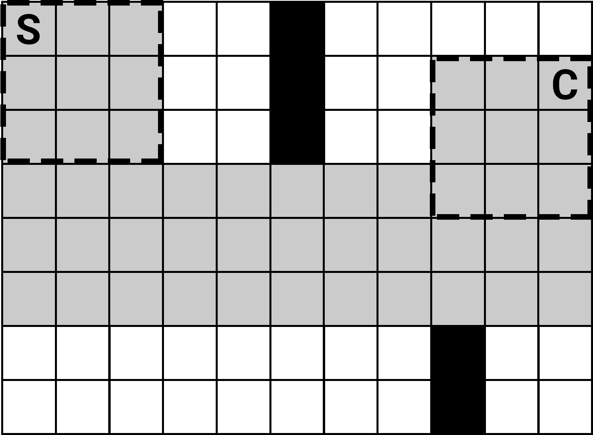

# Skladníci

## Problem Description
Skladníci Jirka a Filip vykladájí kamiony. Jejich úkolem je vyložit všechny krabice z kamionu a musí je pomocí vozíku dostat do určité části skladu. Chodby skladu jsou však úzké, a proto s vozíkem neprojedou všude. Naším úkolem bude najít nejkratší cesty od kamionu k cílovému regálu.

Prostor, v němž se skladníci mohou pohybovat, si zakreslíme jako obdélníkové bludiště o M řádcích a N sloupcích, přičemž každé pole buď je, nebo není průchozí. Známe počáteční pozici vozíku (přesněji jeho levého horního rohu) a máme zakreslenou pozici regálu (jedno políčko), do níž ho chceme dovézt. Vozík, který skladníci používají, má rozměry A x B, kde A je počet řádků a B je počet sloupců, které vozík zabírá.

V každém kroku mohou skladníci posunout celý vozík o jedno políčko doleva, doprava, nahoru nebo dolů. Vždy však všechna pole vozíku musí být na průchozích polích.

Naším 	úkolem je najít nejkratší cestu, po které s takovým vozíkem mohou Jirka s Filipem dojet do cíle. Za dosažení cíle považujeme, když se libovolná část vozíku ocitne na cílovém políčku. Délkou cesty rozumíme celkový počet kroků (posunů vozíku).

Uvažujme například následující bludiště:

Jedna z možných nejkratších cest je naznačena šedou barvou. Čárkovaně je naznačen obrys vozíku na začátku a konci trasy. Nejkratší cesta má 13 kroků.

## Session

- **Date**: 26. 06. 2018
- **Place**: Panorama Caffe Bar
- **Participants**: Václav Pavlíček, Vojtěch Müller, Petr Filip, Martin Lepeška, Jan Voráček
- **IDE/Language**: Papíry A4/Pastelky